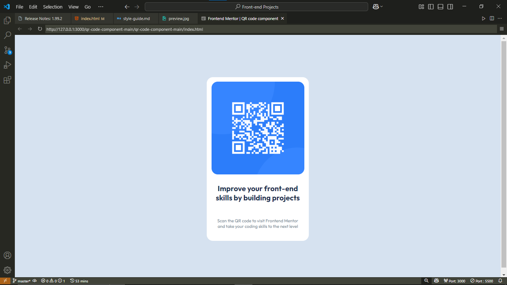

# Frontend Mentor - QR code component solution

This is a solution to the [QR code component challenge on Frontend Mentor](https://www.frontendmentor.io/challenges/qr-code-component-iux_sIO_H). Frontend Mentor challenges help you improve your coding skills by building realistic projects.

## Table of contents

- [Overview](#overview)
  - [Screenshot](#screenshot)
  - [Links](#links)
- [My process](#my-process)
  - [Built with](#built-with)
  - [What I learned](#what-i-learned)
  - [Continued development](#continued-development)
  - [Useful resources](#useful-resources)
- [Author](#author)
- [Acknowledgments](#acknowledgments)

## Overview

### Screenshot




## My process

### Built with

- Semantic HTML5 markup
- CSS custom properties
- Flexbox

### What I learned

During this project, I learned how to use Flexbox to center elements both horizontally and vertically. Here is an example of the CSS I used:

```css
.attribution {
  display: flex;
  flex-direction: column;
  justify-content: center;
  align-items: center;
  height: 100vh;
}

Continued development
In future projects, I want to continue improving my skills in responsive design and explore more advanced CSS techniques.

Useful resources
MDN Web Docs - Flexbox - This helped me understand the basics of Flexbox and how to use it to center elements.

Author
Frontend Mentor - @Greedy-hydra7
Acknowledgments
Thanks to Frontend Mentor for providing this challenge and helping me improve my front-end skills.

